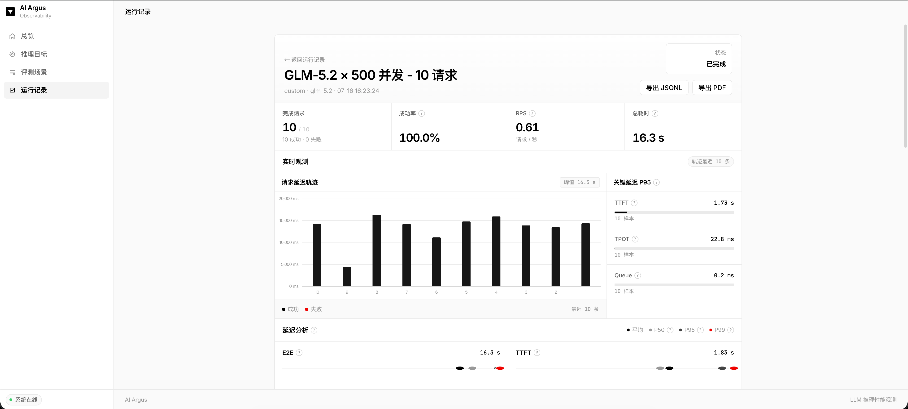

# AI Argus

面向大语言模型推理接口的性能观测平台：管理目标与场景，启动压测，查看延迟、吞吐、可靠性与 Token 指标。



## 能力

- 推理目标：OpenAI 兼容 / 自定义协议、鉴权、扩展请求头与请求体
- 评测场景：并发、请求量、预热、升压、生成参数、超时、重试、提示词
- 运行与报告：实时进度、逐请求日志、分位延迟、Token 吞吐、PDF / JSONL 导出
- 持久化：SQLite 保存配置、运行快照与结果

## 快速开始

需要 Go 1.25+。

```bash
go run ./cmd/server
```

打开 [http://127.0.0.1:8080](http://127.0.0.1:8080)。

```bash
make run
make test
make build
```

修改前端需 Node.js 20+：

```bash
npm ci && npm run build
```

### Docker

```bash
docker build -f deploy/Dockerfile -t ai-argus .
docker run --rm -p 8080:8080 -v ai-argus-data:/app/data ai-argus
```

## 配置

通过环境变量配置，参考 `.env.example`。

| 环境变量 | 默认值 | 说明 |
| --- | --- | --- |
| `ARGUS_ADDRESS` | `127.0.0.1:8080` | HTTP 监听地址 |
| `ARGUS_DATABASE_PATH` | `data/ai-argus.db` | SQLite 路径 |
| `ARGUS_LOG_LEVEL` | `info` | `debug` / `info` / `warn` / `error` |
| `ARGUS_LOG_FORMAT` | `console` | `console` / `json` |
| `ARGUS_GORM_LOG_LEVEL` | `warn` | `silent` / `error` / `warn` / `info` |
| `ARGUS_MAX_CONCURRENCY` | `1000` | 场景最大并发上限 |

## 使用

1. 添加推理目标  
2. 配置评测场景  
3. 启动运行  
4. 查看日志与报告  

历史运行会固化目标与场景快照。

## 指标

| 指标 | 含义 |
| --- | --- |
| `RPS` | 每秒完成请求数 |
| `E2E` | 端到端耗时（含重试） |
| `Queue` | 排队等待时间 |
| `HTTP` | 最后一次 HTTP 尝试耗时 |
| `TTFT` | 首词元延迟 |
| `TPOT` | 每输出词元平均耗时 |
| `Usage Coverage` | 含 Token Usage 的成功请求占比 |

## API

- `GET /health`
- `GET /api/v1/targets`
- `GET /api/v1/scenarios`
- `GET /api/v1/runs/:id`
- `POST /api/v1/runs/:id/cancel`

## 结构

```text
api/                 路由与页面
cmd/server/          入口
config/              配置
database/            SQLite / GORM
internal/benchmark/  调度与指标
internal/protocol/   协议客户端
internal/service/    业务
internal/dao/        数据访问
web/                 模板与静态资源
```

## License

[Apache License 2.0](LICENSE)
